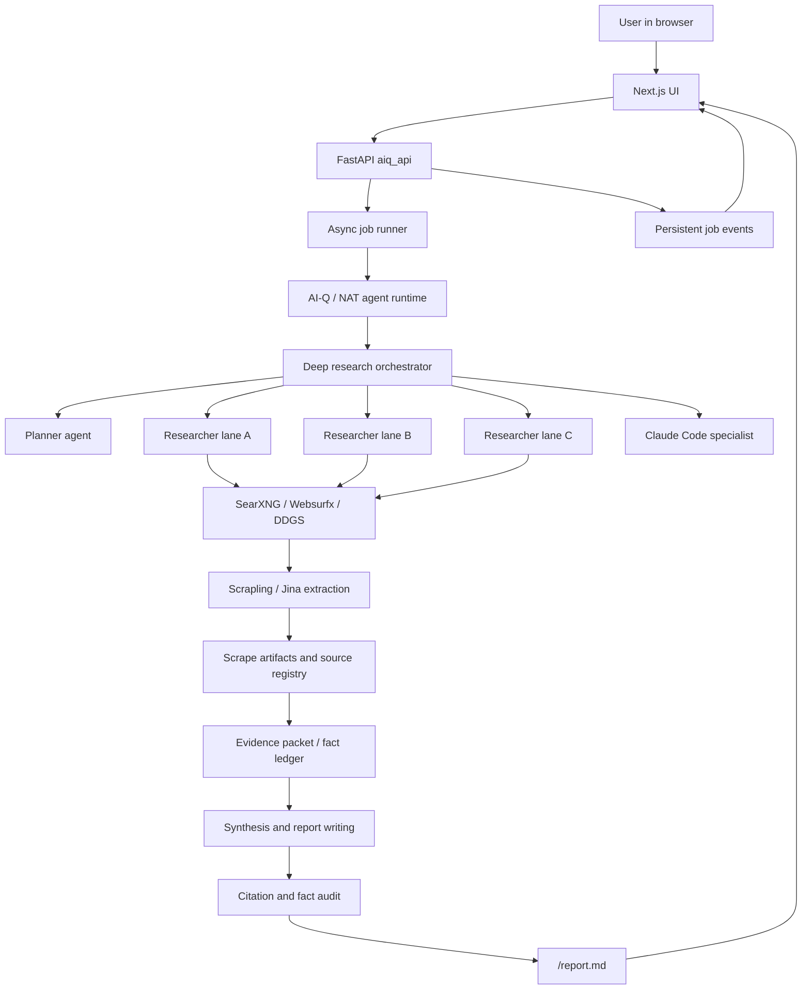

# MiniMax Deep Research

MiniMax Deep Research is a full-stack, multi-agent research application evolved
from NVIDIA's AI-Q Blueprint and NeMo Agent Toolkit foundations. The current app
is no longer just the upstream AI-Q demo: it is a production-oriented research
system for planning, searching, collecting evidence, auditing facts, and writing
source-grounded reports through a FastAPI backend, a Next.js interface, and a
MiniMax M3 based agent stack.

The system is optimized for long-form research workflows where the user needs
more than a chatbot answer: explicit plans, parallel research lanes, durable
artifacts, source quality checks, citation verification, and a final report that
can be inspected after the run.

## Contents

- [What This App Is](#what-this-app-is)
- [Core Capabilities](#core-capabilities)
- [Architecture](#architecture)
- [Research Pipeline](#research-pipeline)
- [Research Modes](#research-modes)
- [Model Strategy](#model-strategy)
- [Search And Web Retrieval](#search-and-web-retrieval)
- [Research Artifacts](#research-artifacts)
- [Quality And Verification Layers](#quality-and-verification-layers)
- [Claude Code Specialist Integration](#claude-code-specialist-integration)
- [Frontend Experience](#frontend-experience)
- [Local Development](#local-development)
- [Oracle App2 Deployment](#oracle-app2-deployment)
- [Configuration](#configuration)
- [Testing](#testing)
- [Repository Layout](#repository-layout)
- [Operational Notes](#operational-notes)
- [Known Limitations](#known-limitations)
- [Upstream Lineage](#upstream-lineage)

## What This App Is

This repository contains a customized deep research platform built around:

- NVIDIA AI-Q / NeMo Agent Toolkit runtime concepts for agent registration,
  tool wiring, and workflow execution.
- DeepAgents and LangGraph style agent orchestration with shared virtual
  filesystem state under `/shared/*`.
- A FastAPI backend in `frontends/aiq_api` that accepts chat and async research
  jobs, streams events, persists job state, and exposes reports.
- A Next.js UI in `frontends/ui` that provides the research interface, plan
  approval, live event traces, artifacts, and final report rendering.
- MiniMax M3 as the active primary model family, accessed through an
  Anthropic-compatible pathway.
- Self-hosted and local retrieval services including SearXNG, Websurfx,
  Scrapling/Jina extraction, DDGS, and optional specialist search providers.

In plain English: this is an AI research workstation. It takes a complex prompt,
turns it into an execution plan, fans out the evidence gathering, stores the
intermediate artifacts, audits the report, and presents the result in a browser.

## Core Capabilities

- User-facing plan previews before expensive research begins.
- Typed deep research plans committed through a `write_plan` tool instead of
  fragile free-form file writes.
- Shallow, medium, deeper, and deep research modes.
- Parallel researcher lanes with per-task search budgets.
- Search budget allocation across modules rather than a single undifferentiated
  pool.
- Websurfx-backed advanced discovery for higher-quality broad search on deeper
  workflows.
- SearXNG-backed general web search for broad compatibility and fallback.
- Durable scrape artifacts for pages, extracts, and citation evidence.
- Source classification and source quality gates.
- Fact ledger and evidence packet artifacts for structured synthesis.
- Citation registry and reference rebuilding for final reports.
- Report fact audit to catch unsupported, contradicted, stale, or malformed
  claims.
- Optional Claude Code specialist calls for planning advice, gap analysis, and
  high-context synthesis assistance.
- Oracle app2 deployment with Docker Compose, PostgreSQL, SearXNG, Websurfx,
  Redis, backend, frontend, and speech services.

## Architecture



The important architectural idea is that the model is not asked to remember
everything in chat context. Research creates durable intermediate artifacts, and
later stages read those artifacts.

## Research Pipeline

The exact route depends on the selected mode, but the current deep research
pathway works like this.

1. **Request intake**

   The UI submits a chat or async research request to the FastAPI backend. The
   backend records a job, streams status through SSE, and starts the agent
   workflow.

2. **Intent and clarification**

   The system decides whether the request is shallow chat, research, or a deeper
   async job. For interactive flows, the user can approve or revise a plan before
   execution. Direct async submissions also receive deterministic plan preload
   protection so they do not depend only on an LLM successfully writing a plan.

3. **Plan construction**

   The planner turns the user request into a structured plan with:

   - title and scope
   - research sections
   - researcher task modules
   - seed queries
   - target source types
   - budget allocation
   - high-risk claims to verify
   - output expectations

   The plan is committed through `write_plan`, validated against
   `DeepResearchPlan`, normalized for provider-specific oddities, then exposed as
   `/shared/plan.json`.

4. **Plan inspection and repair**

   The orchestrator checks whether a usable plan already exists. If the planner
   stalls, writes malformed nested structures, or returns provider-shaped
   arguments like `{"item": ...}`, middleware normalizes the structure before it
   reaches the schema. Artifact events for `/shared/plan.json` are emitted only
   after a successful write.

5. **Optional Claude Code specialist**

   When the task is broad, high-context, synthesis-heavy, or structurally
   complex, the orchestrator can ask a Claude Code specialist for a bounded
   planning or synthesis memo. The prompt specifies the exact expected output
   file and keeps the specialist from performing uncontrolled web research when
   the desired role is orchestration advice.

6. **Research task fan-out**

   The orchestrator launches multiple researcher tasks. Each task receives a
   scoped assignment, a search budget, source-quality preferences, and expected
   artifacts. Researchers search, browse, scrape, summarize, and write notes or
   structured evidence into `/shared/*`.

7. **Evidence compilation**

   The system builds structured artifacts such as evidence packets, fact ledgers,
   source registries, source scores, and claim or section briefs where enabled.
   This reduces reliance on long conversational memory.

8. **Gap and quality checks**

   The workflow checks for weak source concentration, missing key sections,
   unsupported claims, stale facts, and citation integrity. For some paths, gap
   finding can trigger targeted follow-up research before synthesis.

9. **Synthesis**

   The orchestrator writes the report using the collected artifacts rather than
   only the raw chat trace. The report is written to `/report.md` and streamed to
   the UI as it becomes available.

10. **Verification and finalization**

    Citation verification, reference rebuilding, source quality reporting, and
    report fact audits run after synthesis. The report should still be delivered
    if a quality layer fails, but the failure should be visible rather than
    silent.

## Research Modes

The active modes are defined in code and configuration rather than hard-coded in
the UI alone. Budget numbers and model choices should be checked in
`src/aiq_agent/common/research_depth.py` and
`configs/config_cli_minimax_ddgs.yml`.

| Mode | Purpose | Typical Behavior |
| --- | --- | --- |
| `shallow` | Fast answer with light research | Uses a smaller bounded search path. Best for quick questions, initial orientation, and lower-stakes requests. |
| `medium` | Experimental speed tier | Uses a more research-capable budget profile than shallow while keeping MiniMax M3 thinking mostly off to test faster end-to-end delivery. |
| `deeper` | Main serious research tier | Uses structured planning, parallel researcher tasks, Websurfx-backed advanced discovery, source quality checks, and MiniMax M3 fast pathways. |
| `deep` | Highest rigor tier | Designed for larger reports and higher-stakes synthesis. Can enable more expensive reasoning, verification, and long-context synthesis behavior. |

The guiding principle is not simply "more searches equals better report." The
system tries to distribute research budget across the actual subproblems in the
query, preserve enough reserve for gap filling, and prioritize source quality
early.

## Model Strategy

The current active app is MiniMax-first.

- MiniMax M3 is the primary model family.
- Thinking-off pathways are preferred for fast planning, classification, and
  bounded research loops when the task does not need long reflective reasoning.
- Thinking-enabled or higher-effort pathways are reserved for high-stakes
  orchestration, large-document reasoning, deep synthesis, or verification where
  the extra latency is justified.
- Older NVIDIA and reference model configuration remains in the repository for
  upstream compatibility and experimentation, but the active Oracle app2 config
  is the MiniMax config.

The main active config is:

```text
configs/config_cli_minimax_ddgs.yml
```

The design lesson from production use is that MiniMax M3 can be very strong, but
only if long-context and thinking are used deliberately. Putting thinking on
every short loop can make jobs much slower and can worsen tool-call reliability.

## Search And Web Retrieval

The research system separates search discovery from page extraction.

### Discovery

- `web_search_tool` uses the SearXNG/Jina search path.
- `advanced_web_search_tool` can use Websurfx hybrid discovery.
- Websurfx can fan out to engines such as Searx, Brave, DuckDuckGo, LibreX,
  Mojeek, Qwant, Startpage, Yahoo, Bing, and SepiaSearch depending on config.
- SearXNG remains available for compatibility and fallback.
- DDGS may appear as an engine or provider label in event traces depending on
  the active search tool path.

### Extraction

After a result is selected, content is fetched and extracted through the app's
scrape pipeline. The current stack includes Scrapling/Jina style extraction and
artifact persistence so later stages can cite and inspect source content.

### Source Strategy

The system is being pushed toward source quality before volume:

- prefer primary sources for numeric, legal, technical, and funding claims
- prefer academic or standards bodies for research claims
- prefer first-party docs for product specifications
- use trade press as useful context, not as sole authority for hard numbers
- treat content-marketing sources as weak unless corroborated

## Research Artifacts

Deep research jobs use a virtual filesystem exposed to agents. Common paths
include:

```text
/shared/plan.json
/shared/evidence_packet.json
/shared/fact_ledger.json
/shared/sources.json
/shared/source_quality_report.json
/shared/claim_table.json
/shared/section_briefs/
/shared/notes_*.md
/report.md
```

The virtual filesystem is LangGraph/DeepAgents state, not the host disk. That is
why the system avoids having multiple researcher agents write the same file at
the same time. Per-task artifacts are safer, then deterministic Python merge
steps can build shared summary files.

Scrape artifacts and job events are persisted outside the virtual filesystem so
the UI and backend can recover, inspect, or stream them later.

## Quality And Verification Layers

The app has several layers intended to reduce hallucination and report
corruption.

### Plan Validation

Planner output is schema-validated. Provider-specific nested tool arguments are
normalized before validation. A malformed plan should no longer silently become
a generic fallback plan.

### Source Classification

URLs are classified into source classes such as first-party, primary issuer,
academic, authoritative third party, vendor marketing, content marketing, forum,
or unknown. Classification is imperfect, but it gives downstream code a way to
avoid treating all citations equally.

### Source Quality Gates

The system can report domain concentration, class distribution, weak-source
concentration, and authority floor warnings. These gates should warn and
calibrate, not censor useful reports.

### Evidence Packet And Fact Ledger

Evidence packets and fact ledgers give synthesis a structured basis for claims.
They are intended to stop the writer from inventing precise statistics or
crossing facts between similar companies, papers, or funding rounds.

### Citation Verification

Citation verification and reference rebuilding try to ensure inline citations
point to real, registered sources and that the final reference list is
traceable.

### Report Fact Audit

The report fact audit looks for:

- unsupported precise claims
- contradicted claims
- stale time-sensitive facts
- citation-number collisions
- garbled or duplicated reference tails
- suspicious repository, paper, or funding claims

The goal is calibrated reliability: enough content to be useful, but with
visible warnings where source support is weak.

## Claude Code Specialist Integration

The app can call a Claude Code specialist backed by MiniMax M3 for tasks where a
plain researcher loop is the wrong abstraction.

Good uses:

- converting a broad user prompt into a strong research-direction memo
- auditing a plan before expensive research begins
- reviewing gathered evidence for gaps and contradictions
- producing structured synthesis inputs from many source notes
- generating analysis scripts or tables when evidence needs computation

Poor uses:

- simple web search
- browsing one or two pages
- uncontrolled parallel research outside the app's own source registry
- vague prompts that do not specify the expected artifact path

Specialist prompts should say exactly what file the app is waiting for and what
format it must contain. For example:

```text
Write a concise planning memo to /shared/claude_code/planning_memo.md.
Do not perform web search. Use only the supplied query, plan, source policy,
and available tool descriptions.
```

This keeps Claude Code useful as an orchestration and synthesis assistant
instead of a second disconnected research agent.

When Claude Code is backed by MiniMax, the subprocess environment must use
`ANTHROPIC_BASE_URL=https://api.minimax.io/anthropic` and
`ANTHROPIC_AUTH_TOKEN=$MINIMAX_API_KEY`. The current Claude Code `--bare`
runtime also requires `ANTHROPIC_API_KEY=$MINIMAX_API_KEY`, even when requests
are routed through the MiniMax Anthropic-compatible base URL.

## Frontend Experience

The browser interface supports:

- research prompt entry
- mode selection
- plan preview and approval
- live agent, tool, and thought traces
- SSE reconnect handling
- artifact display
- final report rendering
- job history and recovery paths

The UI is intentionally app-like rather than a static NVIDIA blueprint page. The
home screen, job pages, and research panel should reflect the current MiniMax
research product identity while preserving clear operational visibility.

Local default URLs:

```text
Frontend: http://127.0.0.1:3000
Backend:  http://127.0.0.1:9000
Health:   http://127.0.0.1:9000/health
SearXNG:  http://127.0.0.1:8080
```

Oracle app2 frontend is normally exposed through the configured app2 route or
through the app2 frontend container on port `3110` at the host level.

## Local Development

Start the local MiniMax deep research stack:

```bash
./scripts/run_minimax_deep_research.sh
```

Stop the local stack:

```bash
FORCE_STOP_DEEP_RESEARCH=1 ./scripts/stop_deep_research.sh
```

Check backend health:

```bash
curl -s http://127.0.0.1:9000/health
```

The local workspace root used by the current desktop workflow is:

```text
/Volumes/SrijanExt/Users/Srijan/Downloads/code/minimax/nvda-deep-research
```

## Oracle App2 Deployment

The Oracle deployment is the main remote test target for the customized app.

Typical Oracle root:

```text
/opt/stacks/app2/deep-research
```

Default sync and restart command:

```bash
./scripts/sync_app2_deep_research.sh --apply --restart all
```

Per `AGENTS.md`, after code or config changes that affect the deep-research app,
sync to Oracle app2 and restart affected services. Backend, prompt, planner,
research, or middleware changes should restart the backend. UI changes should
restart the frontend. If impact is unclear, restart both.

Common app2 containers include:

```text
app2-aiq-agent
app2-aiq-blueprint-ui
app2-aiq-postgres
app2-aiq-searxng
app2-aiq-websurfx
app2-aiq-websurfx-redis
app2-aiq-kokoro
```

App2 Compose file:

```text
deploy/compose/docker-compose.app2.yaml
```

The app2 deployment uses environment wiring for SearXNG, Websurfx, database
state, MiniMax keys, and feature flags. Do not print secrets into logs or docs.

## Configuration

Primary active config:

```text
configs/config_cli_minimax_ddgs.yml
```

Important environment variables include:

| Variable | Purpose |
| --- | --- |
| `MINIMAX_API_KEY` | MiniMax API credential. |
| `SEARXNG_URL` | SearXNG endpoint used by standard web search. |
| `WEBSURFX_URL` | Websurfx endpoint used by advanced discovery. |
| `WEBSURFX_ENGINES` | Comma-separated Websurfx engine list. |
| `AIQ_ADVANCED_DISCOVERY_BACKEND` | Selects advanced discovery backend behavior. |
| `NAT_JOB_STORE_DB_URL` | Database URL for persisted job state. |
| `EXA_API_KEY` | Optional specialist search provider key where configured. |

Configuration is split between AI-Q/NAT YAML config, FastAPI settings, frontend
environment files, Docker Compose files, and shell scripts. When debugging a
behavior difference between local and Oracle, inspect both the YAML config and
the app2 Compose environment.

## Testing

Run the Python test suite:

```bash
.venv/bin/pytest
```

Run lint:

```bash
.venv/bin/ruff check src frontends/aiq_api/src tests
```

Useful targeted tests include:

```bash
.venv/bin/pytest tests/aiq_agent/agents/deep_researcher/test_plan_tools.py
.venv/bin/pytest tests/aiq_agent/agents/deep_researcher/test_custom_middleware.py
.venv/bin/pytest tests/aiq_agent/jobs/test_runner.py
```

For frontend changes, run the relevant package scripts from `frontends/ui`.
After significant UI changes, verify the app in a browser against the local or
Oracle target.

## Repository Layout

```text
src/aiq_agent/
  agents/
    chat_researcher/
    clarifier/
    deep_researcher/
    shallow_researcher/
  common/
    citation_verification.py
    claude_code_specialist.py
    evidence_packet.py
    fact_ledger.py
    report_fact_audit.py
    research_artifacts.py
    source_classification.py
    source_quality_gates.py
    source_scoring.py

frontends/
  aiq_api/       FastAPI backend, job runner, callbacks, persistence
  ui/            Next.js frontend

configs/
  config_cli_minimax_ddgs.yml

deploy/
  compose/
    docker-compose.app2.yaml

scripts/
  run_minimax_deep_research.sh
  stop_deep_research.sh
  sync_app2_deep_research.sh

tests/
  aiq_agent/
```

## Operational Notes

- The shared `/shared/*` filesystem is agent state, not ordinary disk.
- Research jobs can be interrupted by deploys and restarts. This is acceptable
  when runtime changes are more important than preserving a bad in-flight job.
- User-facing plan quality is part of the product, not a cosmetic detail. A
  fallback-looking plan is considered a workflow failure.
- Search budgets should be allocated across the actual modules in a query.
  Over-spending on early broad tasks can starve later comparative or synthesis
  tasks.
- If a source is unknown, the system should not automatically discard it, but it
  should avoid treating it like a primary source for hard factual claims.
- Precise numbers that support the report's central thesis are the highest-risk
  claims and should receive extra verification.

## Known Limitations

- Source classification is still incomplete for the open web. Many real sources
  will initially appear as `unknown`.
- Search quality depends on upstream engines, rate limits, and extraction
  success. Websurfx and SearXNG improve discovery but do not guarantee source
  authority.
- LLM tool calling can still fail, stall, or claim that it wrote a file before a
  valid artifact exists. Typed tools and schema checks reduce this risk but do
  not eliminate it.
- Long reports can still suffer from citation drift, stale business facts,
  duplicated references, or malformed tails. The report audit and reference
  rebuild layers are meant to catch these before delivery.
- MiniMax M3 thinking improves some high-context reasoning tasks but can slow
  down or destabilize short tool loops. Use it selectively.

## Upstream Lineage

This project began as a fork/customization of NVIDIA's AI-Q Blueprint research
application. The upstream AI-Q and NeMo Agent Toolkit concepts still matter:
workflow registration, tool configuration, agent runtime structure, and many
original docs remain in the repository.

However, the current product has evolved into a MiniMax-centered deep research
system with custom planning, retrieval, source quality, verification, Oracle
deployment, and frontend behavior. Treat this README as the current operational
map for the app; treat older NVIDIA-specific documentation as upstream reference
material unless it has been updated for the current MiniMax app.

## License

The inherited project uses the upstream license terms included in this
repository. Check `LICENSE` and upstream notices before redistributing derived
work.
