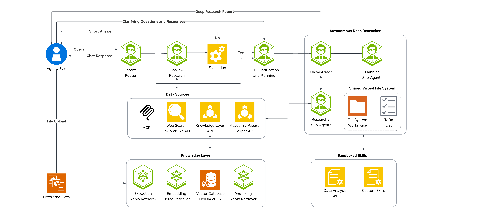

## Start Here: MiniMax Deep Research

From the repo root, run this single command to start fresh:

```bash
./scripts/run_minimax_deep_research.sh
```

This clears any existing local backend/frontend listeners for this app, verifies the MiniMax/SearXNG/Scrapling workflow dependencies, starts SearXNG if needed, and launches:

- Backend: `http://localhost:9000`
- Frontend: `http://localhost:3000`
- Workflow config: `configs/config_cli_minimax_ddgs.yml`

Stop everything later with:

```bash
FORCE_STOP_DEEP_RESEARCH=1 ./scripts/stop_deep_research.sh
```

<!--
SPDX-FileCopyrightText: Copyright (c) 2025-2026, NVIDIA CORPORATION & AFFILIATES. All rights reserved.
SPDX-License-Identifier: Apache-2.0

Licensed under the Apache License, Version 2.0 (the "License");
you may not use this file except in compliance with the License.
You may obtain a copy of the License at

http://www.apache.org/licenses/LICENSE-2.0

Unless required by applicable law or agreed to in writing, software
distributed under the License is distributed on an "AS IS" BASIS,
WITHOUT WARRANTIES OR CONDITIONS OF ANY KIND, either express or implied.
See the License for the specific language governing permissions and
limitations under the License.

-->
## Deep Research Local Run

Start both the backend and frontend:

```bash
./scripts/start_deep_research.sh
```

Stop both local services:

```bash
./scripts/stop_deep_research.sh
```

Defaults: backend `http://localhost:9000`, frontend `http://localhost:3000`, logs and PID files in `.deep-research-runtime/`. Override with environment variables when needed:

```bash
AIQ_CONFIG_FILE=configs/config_cli_minimax_ddgs.yml BACKEND_PORT=9000 FRONTEND_PORT=3000 ./scripts/start_deep_research.sh
```

<h1>NVIDIA AI-Q Blueprint</h1>

> **🏆 BENCHMARK NOTE 🏆**
>
> To obtain results consistent with the **nvidia-aiq** [DeepResearch Bench](https://huggingface.co/spaces/muset-ai/DeepResearch-Bench-Leaderboard) and [DeepResearch Bench II](https://agentresearchlab.com/benchmarks/deepresearch-bench-ii/index.html#leaderboard) leaderboard results, please use the [`drb1`](https://github.com/NVIDIA-AI-Blueprints/aiq/tree/drb1) and [`drb2`](https://github.com/NVIDIA-AI-Blueprints/aiq/tree/drb2) branches, respectively.


## Table of Contents
- [Overview](#overview)
- [Software Components](#software-components)
- [Target Audience](#target-audience)
- [Prerequisites](#prerequisites)
- [Architecture](#architecture)
- [Getting Started](#getting-started)
  - [Clone the Repository](#clone-the-repository)
  - [Automated Setup](#automated-setup)
  - [Obtain API Keys](#obtain-api-keys)
  - [Set Up Environment Variables](#set-up-environment-variables)
- [Configuration Files](#configuration-files)
- [Ways to Run the Agents](#ways-to-run-the-agents)
  - [Command-line interface (CLI)](#command-line-interface-cli)
  - [Web UI](#web-ui)
  - [Async Deep Research Jobs](#async-deep-research-jobs)
  - [Benchmarks](#benchmarks)
  - [Jupyter Notebooks](#jupyter-notebooks)
- [Evaluating the Workflow](#evaluating-the-workflow)
  - [Available Benchmarks](#available-benchmarks)
  - [Running Evaluations](#running-evaluations)
- [Development](#development)
- [Roadmap](#roadmap)
- [Security Considerations](#security-considerations)
- [License](#license)

## Overview

The NVIDIA AI-Q Blueprint is an enterprise-grade research agent built on the [NVIDIA NeMo Agent Toolkit](https://docs.nvidia.com/nemo/agent-toolkit/latest/) and uses [LangChain Deep Agents](https://docs.langchain.com/oss/python/deepagents/overview). It gives you both **quick, cited answers** and **in-depth, report-style research** in one system, with benchmarks and evaluation harnesses so you can measure quality and improve over time.

<p align="center">

</p>

**Key features:**

- **Orchestration node** — One node classifies intent (meta vs. research), produces meta responses (for example, greetings, capabilities), and sets research depth (shallow vs. deep).
- **Shallow research** — Bounded, faster researcher with tool-calling and source citation.
- **Deep research** — Long-running multi-step planning and research to generate a long-form citation-backed report.
- **Workflow configuration** — YAML configs define agents, tools, LLMs, and routing behavior so you can tune workflows without code changes.
- **Modular workflows** — All agents (orchestration node, shallow researcher, deep researcher, clarifier) are composable; each can run standalone or as part of the full pipeline.
- **Skills and sandbox execution** — Deep research can load built-in DeepAgents skills, including the `data-table-analysis` workflow, and run code-oriented work in a job-scoped Modal sandbox.
- **Portable agent skill** — AI-Q ships `.agents/skills/aiq-research/` so compatible coding harnesses can call a local AI-Q server for routed chat and async deep research jobs.
- **Data source registry** — UI toggles and request payloads can select web, paper, enterprise, collaboration, and knowledge-layer sources per message.
- **Production API and auth** — REST endpoints, async job ownership, token validator entry points, and provider lifecycle hooks support authenticated deployments.
- **Profiling and cost analysis** — Tokenomics reports combine NAT profiler traces with pricing configuration for cost, latency, and cache analysis.
- **Evaluation harnesses** — Built-in benchmarks (for example, FreshQA, DeepResearch) and evaluation scripts to measure quality and iterate on prompts and agent architecture.
- **Frontend options** — Run through CLI, web UI, or async jobs. Refer to [Getting started](#getting-started) and [Ways to run the agents](#ways-to-run-the-agents).
- **Deployment options** - Deployment assets for a [docker compose](deploy/compose/) as well as [helm deployment](deploy/helm/deployment-k8s/).


## Software Components

The following are used by this project in the default configuration:

- [NVIDIA NeMo Agent Toolkit](https://docs.nvidia.com/nemo/agent-toolkit/latest/)
- [NVIDIA nemotron-3-nano-30b-a3b](https://build.nvidia.com/nvidia/nemotron-3-nano-30b-a3b/modelcard) (agents, researcher)
- [NVIDIA nemotron-3-super-120b-a12b](https://build.nvidia.com/nvidia/nemotron-3-super-120b-a12b/modelcard) (optional, compatible but Build API has limited availability due to high demand)
- [NVIDIA nemotron-3-nano-30b-a3b](https://build.nvidia.com/nvidia/nemotron-3-nano-30b-a3b/modelcard) (intent classifier)
- [GPT-OSS-120B](https://build.nvidia.com/openai/gpt-oss-120b/modelcard) (agents)
- [NVIDIA nemotron-mini-4b-instruct](https://build.nvidia.com/nvidia/nemotron-mini-4b-instruct/modelcard) (document summary, if used)
- [NVIDIA llama-nemotron-embed-vl-1b-v2](https://build.nvidia.com/nvidia/llama-nemotron-embed-vl-1b-v2) (embedding model for llamaindex knowledge layer implementation, if used)
- [NVIDIA nemotron-nano-12b-v2-vl](https://build.nvidia.com/nvidia/nemotron-nano-12b-v2-vl) (vision-language model for llamaindex knowledge layer implementation, if used)
- [Tavily Search API](https://tavily.com/) for web search
- [Serper Search API](https://serper.dev/) for paper search (Google Scholar)

## Target Audience

This project is for:

- **AI researchers and developers**: People building or extending agentic research workflows
- **Enterprise teams**: Organizations needing tool-augmented research with citation-backed research
- **NeMo Agent Toolkit users**: Developers looking to understand advanced multi-agent patterns

## Prerequisites

- Python 3.11–3.13
- [uv](https://github.com/astral-sh/uv) package manager
- NVIDIA API key from [NVIDIA AI](https://build.nvidia.com) (for NIM models)
- Node.js 22+ and npm (optional, for web UI mode)


**Optional requirements:**
- Tavily API key (for web search functionality)
- Serper API key (for academic paper search functionality)

> **Note:** Configure at least one data source (Tavily web search, Serper search tool, or knowledge layer) to enable research functionality.

If these optional API keys are not provided, the agent continues to operate without the corresponding search capabilities. Refer to [Obtain API Keys](#obtain-api-keys) for details.

## Hardware Requirements

When using [NVIDIA API Catalog](https://build.nvidia.com/) (the default), inference runs on NVIDIA-hosted infrastructure and there are no local GPU requirements. The hardware references below apply only when self-hosting models via [NVIDIA NIM](https://docs.nvidia.com/nim/).

| Component | Default Model | Self-Hosted Hardware Reference |
|-----------|---------------|-------------------------------|
| LLM (research subagent) | `nvidia/nemotron-3-nano-30b-a3b` (default) or `nvidia/nemotron-3-super-120b-a12b` (optional) | [Nemotron 3 Nano support matrix](https://docs.nvidia.com/nim/large-language-models/latest/supported-models.html#nvidia-nemotron-3-nano), [Nemotron 3 Super support matrix](https://docs.nvidia.com/nim/large-language-models/latest/supported-models.html#nvidia-nemotron-3-super-120b-a12b) |
| LLM (intent classifier) | `nvidia/nemotron-3-nano-30b-a3b` | [Nemotron 3 Nano support matrix](https://docs.nvidia.com/nim/large-language-models/latest/supported-models.html#nvidia-nemotron-3-nano) |
| LLM (deep research orchestrator, planner) | `openai/gpt-oss-120b` | [GPT OSS support matrix](https://docs.nvidia.com/nim/large-language-models/latest/supported-models.html#gpt-oss-120b) |
| Document summary (optional) | `nvidia/nemotron-mini-4b-instruct` | [Nemotron Mini 4B](https://build.nvidia.com/nvidia/nemotron-mini-4b-instruct/) |
| Text embedding | `nvidia/llama-nemotron-embed-vl-1b-v2` | [NeMo Retriever embedding support matrix](https://docs.nvidia.com/nim/nemo-retriever/text-embedding/latest/support-matrix.html) |
| VLM (image/chart extraction, optional) | `nvidia/nemotron-nano-12b-v2-vl` | [Vision language model support matrix](https://docs.nvidia.com/nim/vision-language-models/latest/support-matrix.html#nemotron-nano-12b-v2-vl) |
| Knowledge layer (Foundational RAG, optional) | -- | [RAG Blueprint support matrix](https://docs.nvidia.com/rag/latest/support-matrix.html) |

For detailed installation instructions, refer to [Installation -- Hardware Requirements](docs/source/get-started/installation.md#hardware-requirements).

## Architecture

AI-Q uses a [LangGraph](https://www.langchain.com/langgraph)-based state machine with the following key components:

- **Orchestration node**: Classifies intent (meta vs. research), produces meta responses when needed, and sets depth (shallow vs. deep) in one step
- **Shallow research agent**: Bounded tool-augmented research optimized for speed
- **Deep research agent**: Multi-phase research with planning, iteration, and citation management

Each agent can be run individually or as part of the orchestrated workflow. For detailed architecture documentation, refer to [Architecture](docs/source/architecture/overview.md).

## Getting Started

### Clone the Repository

```bash
git clone https://github.com/NVIDIA-AI-Blueprints/aiq.git && cd aiq
```

### Automated Setup

Run the setup script to initialize the environment:

```bash
./scripts/setup.sh
```

This script:
- Creates a Python virtual environment with uv
- Installs all Python dependencies (core, frontends, benchmarks, data sources)
- Installs UI dependencies (if Node.js is available)

### Manual Installation

For selective installation, install packages individually:

```bash
# Create and activate virtual environment
uv venv --python 3.13 .venv
source .venv/bin/activate

# Install core with development dependencies
uv pip install -e ".[dev]"

# Install frontends (pick what you need)
uv pip install -e ./frontends/cli          # CLI frontend
uv pip install -e ./frontends/debug        # Debug console
uv pip install -e ./frontends/aiq_api      # Unified API (includes debug)

# Install benchmarks (pick what you need)
uv pip install -e ./frontends/benchmarks/freshqa

# Install data sources (pick what you need)
uv pip install -e ./sources/tavily_web_search
uv pip install -e ./sources/google_scholar_paper_search
uv pip install -e "./sources/knowledge_layer[llamaindex,foundational_rag]"
```

### Obtain API Keys


| API        | Environment Variable | Purpose                   | Required                                                    |
| ---------- | -------------------- | ------------------------- | ----------------------------------------------------------- |
| NVIDIA API | `NVIDIA_API_KEY`     | LLM inference through NIM | Yes                                                         |
| Tavily     | `TAVILY_API_KEY`     | Web search                | No (if not specified, agent continues without web search)   |
| Serper     | `SERPER_API_KEY`     | Academic paper search     | No (if not specified, agent continues without paper search) |


#### Obtain an NVIDIA API Key

1. Sign in to [NVIDIA Build](https://build.nvidia.com/)
2. Click on any model, then select "Deploy" > "Get API Key" > "Generate Key"

#### Obtain a Tavily API Key

1. Sign in to [Tavily](https://tavily.com/)
2. Navigate to your dashboard
3. Generate an API key

#### Obtain a Serper API Key

1. Sign in to [Serper](https://serper.dev/)
2. Generate an API key from your dashboard

### Set Up Environment Variables

Create a `.env` file in `deploy/` directory:

```bash
cp deploy/.env.example deploy/.env
```

Replace your API keys.

> **Note:** Depending on your usecase, deep research report quality can be enhanced by enabling searching across academic research papers. We use Serper for this. If you want to use paper search, follow the steps in the [Customization guide](docs/source/customization/tools-and-sources.md#disabling-a-tool) to enable it.

## Configuration Files

The `configs/` directory holds YAML workflow configs that define agents, tools, LLMs, and routing. Use the one that matches your run mode and data sources:

| Config | Models | Description |
|--------|--------|-------------|
| `config_cli_default.yml` | Nemotron 3 Nano 30B, GPT-OSS 120B | CLI default. Web search; optional paper search (requires `SERPER_API_KEY`); no knowledge retrieval. Nemotron Super is commented out but can be enabled for higher quality. |
| `config_web_default_llamaindex.yml` | Nemotron 3 Nano 30B, GPT-OSS 120B, Nemotron Mini 4B | Web default. LlamaIndex knowledge retrieval; web search; optional paper search (requires `SERPER_API_KEY`). Nemotron Super is commented out but can be enabled for higher quality. |
| `config_web_frag.yml` | Nemotron 3 Nano 30B, GPT-OSS 120B | Web + Foundational RAG (external RAG server). Helm default. See [RAG Blueprint](https://github.com/NVIDIA-AI-Blueprints/rag/tree/main) for an example RAG deployment. Nemotron Super is commented out but can be enabled for higher quality. |
| `config_frontier_models.yml` | GPT-5.2 (orchestrator/planner), Nemotron 3 Nano 30B, Nemotron Mini 4B | Hybrid: frontier orchestrator/planner, open researcher. LlamaIndex; web search; optional paper search (requires `SERPER_API_KEY`). Requires `OPENAI_API_KEY`. Nemotron Super is commented out but can be enabled for higher quality. |

## Ways to Run the Agents

The `frontends/` directory contains different interfaces for interacting with the agents. You can also run agents directly through the NeMo Agent Toolkit CLI.

### Command-line interface (CLI)

The CLI provides an interactive research assistant in your terminal:

```bash
# Activate the virtual environment
source .venv/bin/activate

# Run with the convenience script
./scripts/start_cli.sh

# Verbose logging
./scripts/start_cli.sh --verbose

# Or run directly with the NeMo Agent Toolkit CLI (dotenv loads deploy/.env into the environment)
dotenv -f deploy/.env run nat run --config_file configs/config_cli_default.yml --input "How do I install CUDA?"
```

The CLI frontend source is in `frontends/cli/`.

### Web UI

For a full web-based experience:

```bash
./scripts/start_e2e.sh
```

This starts:
- Backend API server at `http://localhost:8000`
- Frontend UI at `http://localhost:3000`

The web UI source is in `frontends/ui/`. Refer to [frontends/ui/README.md](frontends/ui/README.md) for more details.

#### Web UI with Docker Compose

You can also run the backend and UI with Docker Compose:

```bash
cd deploy/compose

# No-auth local setup (LlamaIndex default)
docker compose --env-file ../.env -f docker-compose.yaml up -d --build

# To select a different backend config, set BACKEND_CONFIG in deploy/.env, for example:
# BACKEND_CONFIG=/app/configs/config_web_frag.yml
```

For more details, refer to:
- `deploy/compose/README.md`

### Async Deep Research Jobs

Endpoints, SSE streaming, and debug console: refer to [frontends/aiq_api/README.md](frontends/aiq_api/README.md).
For service integrations with MiniMax Deep Research, auth, startup commands, plan approval behavior, and copy-paste client examples, see [docs/deep-research-api.md](docs/deep-research-api.md).

### Benchmarks

To run agents in evaluation mode, refer to the [Evaluating the Workflow](#evaluating-the-workflow) section.

### Jupyter Notebooks

The `docs/notebooks/` directory contains a three-part series that walks through the blueprint from first run to full customization. Run them in order:

| # | Notebook | What it covers | Prerequisites |
|---|----------|----------------|---------------|
| 0 | [Getting Started with AI-Q](docs/notebooks/0_Getting_Started_with_AIQ.ipynb) | Full blueprint overview — environment setup, orchestrated workflow (intent routing, shallow and deep research), and Docker Compose deployment | `NVIDIA_API_KEY`; optionally `TAVILY_API_KEY`, `SERPER_API_KEY` |
| 1 | [Deep Researcher — Web Search](docs/notebooks/1_Deep_Researcher_Web_Search.ipynb) | Deep researcher in depth — Python API, `nat run`, and end-to-end evaluation against the DeepResearch Bench with `nat eval` | Notebook 0 completed; `NVIDIA_API_KEY`, `TAVILY_API_KEY`, `SERPER_API_KEY`; OpenAI or Gemini key for the judge model |
| 2 | [Deep Researcher — Customization](docs/notebooks/2_Deep_Researcher_Customization.ipynb) | Extending the deep researcher — adding paper search, assigning different LLMs per agent role, editing prompts, and enabling the knowledge layer | Notebooks 0 and 1 completed; `NVIDIA_API_KEY`, `TAVILY_API_KEY`, `SERPER_API_KEY` |


## Evaluating the Workflow

The `frontends/benchmarks/` directory contains evaluation pipelines for assessing agent performance.

### Available Benchmarks

| Benchmark | Description | Location |
|-----------|-------------|----------|
| Deep Research Bench | RACE and FACT evaluation for research quality | `frontends/benchmarks/deepresearch_bench/` |
| FreshQA | Factuality evaluation on time-sensitive questions | `frontends/benchmarks/freshqa/` |

### Running Evaluations

### Step 1: Install the dataset

The dataset files are not included in the repository. We have included a script to retrieve them from the [Deep Research Bench Github Repository](https://github.com/Ayanami0730/deep_research_bench/tree/main) and format them for the NeMo Agent Toolkit evaluator.

To download the dataset files, run the following script:

```bash
python frontends/benchmarks/deepresearch_bench/scripts/download_drb_dataset.py
```

### Step 2: Generate reports using NAT evaluation harness

```bash
dotenv -f deploy/.env run nat eval --config_file frontends/benchmarks/deepresearch_bench/configs/config_deep_research_bench.yml
```

### Step 3: Convert the output into a compatible format
```bash
python frontends/benchmarks/deepresearch_bench/scripts/export_drb_jsonl.py --input <path to your workflow_output.json> --output <path to the output file you want to create with .jsonl extension>
```

### Step 4: Run evaluation
Follow instructions in the [Deep Research Bench Github Repository](https://github.com/Ayanami0730/deep_research_bench/tree/main) to run evaluation and obtain scores.


### Optional: Phoenix Tracing

If your config enables Phoenix tracing, start the Phoenix server before running `nat eval`.

Start server (separate terminal):

```bash
source .venv/bin/activate
phoenix serve
```

For detailed benchmark documentation, refer to:
- [Deep Research Bench README](frontends/benchmarks/deepresearch_bench/README.md)
- [FreshQA README](frontends/benchmarks/freshqa/README.md)

## Development

For development, contribution, and documentation, refer to:

- **[Development and Contributing](docs/source/contributing/index.md)**: Setup, testing, PR workflow, sign-off/DCO
- **[Tutorial Notebooks](docs/notebooks/)**: Getting started overview, deeper dive, and customization notebooks
- **[Architecture](docs/source/architecture/overview.md)**: Component details and data flow
- **[Customization](docs/source/customization/index.md)**: Configuration and customization options
- **[Knowledge Layer Setup](sources/knowledge_layer/KNOWLEDGE-LAYER-SETUP.md)**: RAG backends and document ingestion
- **[Agent Skills](docs/source/integration/agent-skills.md)**: Install the portable AI-Q research skill in compatible coding harnesses
- **[Skills and Sandbox Example](docs/source/examples/skills-sandbox/index.md)**: Run deep research with built-in skills and Modal sandbox execution
- **[Profiling and Cost Analysis](docs/source/profiling/index.md)**: Generate tokenomics and latency reports from NAT profiler traces
- **[Docs index](docs/README.md)**: Full documentation list and component docs
- **[Changelog](docs/source/resources/changelog.md)**: Version history and changes

## Roadmap

- [ ] **[NeMo Guardrails](https://github.com/NVIDIA-NeMo/Guardrails) Integration:** Enhance safety and security guardrails.
- [ ] **[NVIDIA Dynamo](https://github.com/ai-dynamo/dynamo) Integration:** Reduce latency via priority scheduling at scale.
- [ ] **MCP Authentication:** Implement secure login/auth for MCP connections.
- [x] **Skills & Sandboxing:** Support built-in deep research skills with job-scoped sandbox execution.
- [ ] **Custom Skill Management:** Add UI and lifecycle controls for user-provided skill bundles.
- [ ] **Dynamic Model Routing:** Allow sub-agents to automatically select the optimal model per task.
- [ ] **Resource Management:** Implement configurable token caps and tool-call budgets.
- [ ] **Expanded Web Search:** Additional integration examples including Perplexity and You.com.
- [ ] **Collaborative Rewriting:** Additional report rewriting agent and HITL Q&A.
- [ ] **Multimedia Output:** Embed audio, video, and images directly into reports.
- [ ] **Voice-to-Text Input:** Integrate [NVIDIA Riva](https://developer.nvidia.com/riva) for hands-free accessibility.

## Security Considerations

- The AI-Q Blueprint is shared as a reference and is provided "as is". The security in the production environment is the responsibility of the end users deploying it. When deploying in a production environment, please have security experts review any potential risks and threats; define the trust boundaries, implement logging and monitoring capabilities, secure the communication channels, integrate AuthN & AuthZ with appropriate access controls, keep the deployment up to date, ensure the containers/source code are secure and free of known vulnerabilities.
- A robust frontend that handles AuthN & AuthZ is highly recommended. Missing AuthN & AuthZ will result in ungated access to customer models if directly exposed e.g. the internet, resulting in either cost to the customer, resource exhaustion, or denial of service.
- End users are encouraged to add [NeMo Guardrails](https://github.com/NVIDIA-NeMo/Guardrails) and additional prompt content filtering to the blueprint. Guardrails will be native in upcoming release.
- The AI-Q Blueprint doesn't require any privileged access to the system.
- Deep research skills can invoke sandboxed code execution for analysis workflows. Keep sandbox credentials, quotas, lifecycle cleanup, and network policy aligned with your deployment's trust boundaries.
- End users are responsible for ensuring the availability of their deployment.
- End users are responsible for building, and patching, the container images to keep them up to date.
- The end users are responsible for ensuring that OSS packages used by the developer blueprint are current.
- The logs from middleware, backend, and demo app are printed to standard out. They can include input prompts and output completions for development purposes. The end users are advised to handle logging securely and avoid information leakage for production use cases.


## License

This project will download and install additional third-party open source software projects. Review the license terms of these open source projects before use, found in [LICENSE-THIRD-PARTY](LICENSE-THIRD-PARTY).

GOVERNING TERMS: AIQ blueprint software and materials are governed by the [Apache License, Version 2.0](https://www.apache.org/licenses/LICENSE-2.0)
