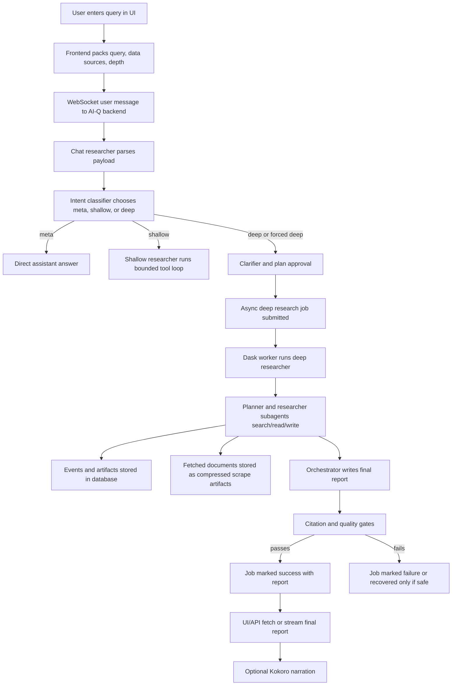

# Deep Research Pipeline: Query to Output

Last updated: 2026-05-28

This document explains, in plain human language, how research currently works in this MiniMax/NVIDIA AI-Q Deep Research platform. It follows the request all the way from the moment a user types a question to the moment the final report, citations, artifacts, history, and optional audio narration are available.

The main local project is:

`/Volumes/SrijanExt/Users/Srijan/Downloads/code/minimax/nvda-deep-research`

The current Oracle app2 deployment lives at:

`/opt/stacks/app2/deep-research`

The deployed app2 backend is intended to be called by app1 through:

`DEEP_RESEARCH_BASE_URL=http://host.docker.internal:9000`

or whatever app1 runtime resolves to the app2 backend host binding.

## The Short Version

The system has two related paths.

1. The interactive UI path starts in the browser, sends the user query over a WebSocket, asks for clarification or plan approval when needed, then submits a real async deep-research job.
2. The API path skips the interactive approval flow and submits an async job directly through REST.

The deep research job then runs in the backend worker. It uses MiniMax M3 models, SearXNG/Jina/Scrapling web search, optional Exa search if configured, optional stock quotes, optional local debate transcript search, and any uploaded document summaries. During the run, it streams status events back to the UI, stores events in the database, stores fetched web documents as compressed artifacts, writes intermediate files, verifies citations, validates the final report, and finally exposes the report through the UI and API.

The important design idea is this:

The browser is not the source of truth for finished research. The durable source of truth is the backend database plus scrape artifact storage. The browser caches UI state only so the app feels fast.

## Main Pieces

The frontend is the Next.js UI under:

`/Volumes/SrijanExt/Users/Srijan/Downloads/code/minimax/nvda-deep-research/frontends/ui`

The backend API plugin is under:

`/Volumes/SrijanExt/Users/Srijan/Downloads/code/minimax/nvda-deep-research/frontends/aiq_api`

The core AI-Q agent code is under:

`/Volumes/SrijanExt/Users/Srijan/Downloads/code/minimax/nvda-deep-research/src/aiq_agent`

The active MiniMax + SearXNG config is:

`/Volumes/SrijanExt/Users/Srijan/Downloads/code/minimax/nvda-deep-research/configs/config_cli_minimax_ddgs.yml`

The local start script is:

`/Volumes/SrijanExt/Users/Srijan/Downloads/code/minimax/nvda-deep-research/scripts/run_minimax_deep_research.sh`

The local stop script is:

`/Volumes/SrijanExt/Users/Srijan/Downloads/code/minimax/nvda-deep-research/scripts/stop_deep_research.sh`

The app2 sync script is:

`/Volumes/SrijanExt/Users/Srijan/Downloads/code/minimax/nvda-deep-research/scripts/sync_app2_deep_research.sh`

The app2 Docker compose file is:

`/Volumes/SrijanExt/Users/Srijan/Downloads/code/minimax/nvda-deep-research/deploy/compose/docker-compose.app2.yaml`

The prepared local debate transcript corpus is:

`/Volumes/SrijanExt/Users/Srijan/Downloads/code/minimax/debate-yt/data/prepared_debate_corpus`

On app2, the transcript corpus is mounted into the backend container at:

`/app/data/prepared_debate_corpus`

## Running Services

In the current app2 design, these are the important services:

`aiq-agent`

FastAPI backend plus the AI-Q/NAT workflow runtime. It owns `/health`, WebSocket chat, async job submission, async job status, reports, data sources, conversation snapshots, and job history.

`frontend`

Next.js UI. It renders the chat, plan approval, research progress panel, final report artifact, citations, files, history, data-source toggles, and Kokoro controls.

`postgres`

Stores async job metadata, event logs, job access metadata, checkpoints, summaries, and UI conversation snapshots.

`searxng`

Self-hosted metasearch used by the SearXNG/Jina web search tools. This must run on the VPS for app2 jobs. The backend uses:

`SEARXNG_URL=http://searxng:8080`

`kokoro`

Kokoro TTS service for audio narration when running in app2 compose. The UI can also fall back to local Kokoro ONNX generation when configured locally.

## The Main Data Flow



## Step 1: User Opens the App

When the UI starts, it loads runtime config and authentication state. If authentication is required, the user must sign in before they can submit research.

The app also loads available data sources from:

`GET /v1/data_sources`

The backend builds that response from the data-source registry in:

`/Volumes/SrijanExt/Users/Srijan/Downloads/code/minimax/nvda-deep-research/configs/config_cli_minimax_ddgs.yml`

Current important sources are:

`web_search`

This is enabled by default. It maps to Exa, SearXNG/Jina web search, advanced SearXNG/Jina web search, and stock quotes.

`debate_transcripts`

This is disabled by default. The user must explicitly enable it. It maps to the local prepared debate transcript corpus.

The frontend source-selection UI is wired through:

`/Volumes/SrijanExt/Users/Srijan/Downloads/code/minimax/nvda-deep-research/frontends/ui/src/features/layout/components/DataSourcesPanel.tsx`

The store that remembers enabled sources is:

`/Volumes/SrijanExt/Users/Srijan/Downloads/code/minimax/nvda-deep-research/frontends/ui/src/features/layout/store.ts`

The backend route that lists sources is:

`/Volumes/SrijanExt/Users/Srijan/Downloads/code/minimax/nvda-deep-research/frontends/aiq_api/src/aiq_api/routes/jobs.py`

## Step 2: User Chooses Research Depth

The UI exposes three depth choices:

`shallow`

Fastest deep-research tier. Current target is 10-20 total sources, up to 2 researcher tasks, 1 parallel researcher task, 8 search calls per researcher task, 20 advanced web searches, and 12 regular web searches.

`deeper`

Balanced default. Current target is 24-48 total sources, up to 5 researcher tasks, 2 parallel researcher tasks, 10 search calls per researcher task, 44 advanced web searches, and 20 regular web searches.

`deep`

Most comprehensive. Current target is 72-120+ sources, up to 10 researcher tasks, 2 parallel researcher tasks, 12 search calls per researcher task, 108 advanced web searches, and 48 regular web searches.

Those limits live in:

`/Volumes/SrijanExt/Users/Srijan/Downloads/code/minimax/nvda-deep-research/src/aiq_agent/common/research_depth.py`

The depth setting is not just cosmetic. It changes how many researcher tasks the deep agent may launch, how many search calls it is allowed to make, and what the planner is instructed to do.

## Step 3: User Sends the Query

The input box lives in:

`/Volumes/SrijanExt/Users/Srijan/Downloads/code/minimax/nvda-deep-research/frontends/ui/src/features/layout/components/InputArea.tsx`

When the user clicks send, the UI checks a few things first:

1. Is the user authenticated if auth is required?
2. Is a research job already running in this session?
3. Is this a normal query or a response to a human-in-the-loop prompt?
4. Are uploaded files still ingesting?

If files are still ingesting, the UI warns the user once. The next submit proceeds if the user intentionally submits again.

For a normal query, the browser calls the WebSocket chat hook:

`/Volumes/SrijanExt/Users/Srijan/Downloads/code/minimax/nvda-deep-research/frontends/ui/src/features/chat/hooks/use-websocket-chat.ts`

That uses the NAT WebSocket client:

`/Volumes/SrijanExt/Users/Srijan/Downloads/code/minimax/nvda-deep-research/frontends/ui/src/adapters/api/websocket-client.ts`

The query is wrapped as JSON text inside the normal chat message:

```json
{
  "query": "the user's actual question",
  "data_sources": ["web_search"],
  "research_depth": "deeper",
  "force_deep_research": true
}
```

The reason it is wrapped this way is compatibility. The NAT chat protocol expects a user message. We put structured settings inside that user message so the backend can recover the actual query, selected sources, selected depth, and whether the UI wants deep research.

## Step 4: WebSocket Backend Authenticates and Starts the Workflow

The reconnectable WebSocket backend is:

`/Volumes/SrijanExt/Users/Srijan/Downloads/code/minimax/nvda-deep-research/frontends/aiq_api/src/aiq_api/websocket_reconnect.py`

It does several jobs:

1. Authenticates the WebSocket connection using the same auth logic as HTTP requests.
2. Registers the active socket by conversation id.
3. Keeps human-in-the-loop prompts alive long enough for reconnects.
4. Keeps the workflow from being killed just because a browser tab disconnects.
5. Times out human-in-the-loop approval after 300 seconds and proceeds with `skip`.

That 300 second timeout matters. If a user receives a plan approval prompt and does nothing for five minutes, the backend resolves the prompt as `skip`. In practice, `skip` is treated as an approval keyword by the clarifier so the job can continue.

## Step 5: The Chat Researcher Parses the Request

The top-level chat orchestrator is:

`/Volumes/SrijanExt/Users/Srijan/Downloads/code/minimax/nvda-deep-research/src/aiq_agent/agents/chat_researcher/agent.py`

The request parser is:

`/Volumes/SrijanExt/Users/Srijan/Downloads/code/minimax/nvda-deep-research/src/aiq_agent/agents/chat_researcher/utils.py`

It unwraps the JSON text and extracts:

`query`

The real user question.

`data_sources`

The data-source ids selected by the user.

`force_deep_research`

Whether the UI is forcing deep-research mode.

`research_depth`

The selected tier: `shallow`, `deeper`, or `deep`.

It also strips provider-specific blocks when necessary. This is important for MiniMax M3 because MiniMax can return Anthropic-style content blocks such as `thinking` and `tool_use`. Some parts of the pipeline need only visible text, not raw provider protocol blocks.

## Step 6: Intent Classifier Decides the Route

The chat researcher starts with an intent classifier.

The config points it at:

`minimax_m3_planner_llm`

The classifier decides whether the request is:

`meta`

Something about the system itself or ordinary chat. This can end quickly with a direct assistant response.

`research`

A real research request.

Then it decides whether the work should be shallow or deep. If `force_deep_research` is true, the route is forced into deep research even if the classifier might otherwise choose shallow.

For shallow work, the graph routes to `shallow_research`.

For deep work, the graph routes to `clarifier`.

The route graph is in:

`/Volumes/SrijanExt/Users/Srijan/Downloads/code/minimax/nvda-deep-research/src/aiq_agent/agents/chat_researcher/agent.py`

## Step 7: Clarifier and Plan Approval

The clarifier is:

`/Volumes/SrijanExt/Users/Srijan/Downloads/code/minimax/nvda-deep-research/src/aiq_agent/agents/clarifier/agent.py`

Its prompt files are:

`/Volumes/SrijanExt/Users/Srijan/Downloads/code/minimax/nvda-deep-research/src/aiq_agent/agents/clarifier/prompts/research_clarification.j2`

`/Volumes/SrijanExt/Users/Srijan/Downloads/code/minimax/nvda-deep-research/src/aiq_agent/agents/clarifier/prompts/plan_generation.j2`

The clarifier has two jobs.

First, it decides whether the query needs clarification. If the question is ambiguous, it asks a focused follow-up.

Second, when `enable_plan_approval: true`, it generates a research plan preview and asks the user to approve, reject, or revise it.

The current config has:

```yaml
clarifier_agent:
  _type: clarifier_agent
  llm: minimax_m3_planner_llm
  planner_llm: minimax_m3_planner_llm
  max_turns: 3
  enable_plan_approval: true
```

The plan approval parser accepts words like:

`approve`, `approved`, `yes`, `ok`, `proceed`, `continue`, `go ahead`, `looks good`, `accept`, and `skip`.

It treats words like:

`reject`, `no`, `cancel`, `stop`, and `abort`

as rejection.

Anything else is treated as feedback and sent back through the plan revision loop.

The clarifier also has defensive logic for common failure modes:

1. If MiniMax returns JSON plus extra text, the parser tries multiple JSON extraction strategies.
2. If MiniMax outputs Markdown instead of JSON, the parser tries to recover a title and section list.
3. If the plan title leaks instruction text like "You are Deep Research", the title is replaced.
4. If sections are generic placeholders like "Introduction", "Findings", or "Conclusion", they are replaced with topic-specific fallback sections.
5. If the task is a structured lesson prompt with `Exact lesson topic` and `Final debate motion`, the deep researcher can later preload a topic-first plan to prevent drift.

## Step 8: Shallow Research Path

The shallow researcher is:

`/Volumes/SrijanExt/Users/Srijan/Downloads/code/minimax/nvda-deep-research/src/aiq_agent/agents/shallow_researcher/agent.py`

It is used for quicker answers and lower-budget research. It still uses tools and citations, but it does not use the full DeepAgents planner/researcher/orchestrator structure.

The shallow path works like this:

1. Render a system prompt with current date, available tools, user info, and uploaded document summaries.
2. Bind the selected tools to the researcher LLM.
3. Let the LLM call tools for up to `max_tool_iterations`.
4. Capture source URLs from tool results into the citation registry.
5. Force synthesis if the tool budget is exhausted.
6. Verify that final citations refer to sources the tools actually returned.
7. Sanitize the report by stripping unsafe or unsupported URLs.
8. Emit the final answer to the UI.

Current config:

```yaml
shallow_research_agent:
  _type: shallow_research_agent
  llm: minimax_m3_llm
  exclude_tools:
    - advanced_web_search_tool
  max_llm_turns: 20
  max_tool_iterations: 10
```

The shallow path can escalate to deep research if the result is weak or explicitly says it lacks enough information. In this deployment, escalation is enabled at the workflow level.

## Step 9: Deep Research Job Submission

For deep research, the interactive chat workflow does not run the full job inline. Instead, it submits an async job.

That handoff happens in:

`/Volumes/SrijanExt/Users/Srijan/Downloads/code/minimax/nvda-deep-research/src/aiq_agent/agents/chat_researcher/register.py`

The submit function is:

`/Volumes/SrijanExt/Users/Srijan/Downloads/code/minimax/nvda-deep-research/frontends/aiq_api/src/aiq_api/jobs/submit.py`

The chat workflow passes:

`agent_type`

Usually `deep_researcher`.

`input_text`

The original user query, plus clarification context if there was an approved plan.

`owner`

The current authenticated principal, or a no-auth internal principal when auth is disabled.

`available_documents`

Summaries of uploaded documents tied to the conversation.

`data_sources`

The selected source ids.

`research_depth`

The selected depth tier.

`auth_token`

The caller token, if needed by any selected source.

The job is submitted to Dask through NAT's `JobStore`. The job id is stored in the database, ownership metadata is written to `job_access`, and a `job.submitted` event is stored in `job_events`.

The chat response sent back over WebSocket is intentionally short:

```text
Deep research job submitted. Job ID: <job_id>
```

The frontend recognizes that message, adds a "starting" banner, creates a hidden tracking message with the job id, and switches to the SSE stream for real progress.

That recognition happens in:

`/Volumes/SrijanExt/Users/Srijan/Downloads/code/minimax/nvda-deep-research/frontends/ui/src/features/chat/hooks/use-websocket-chat.ts`

## Step 10: Direct API Submission Path

Developers can skip the interactive WebSocket path and submit directly:

`POST /v1/jobs/async/submit`

The backend route is:

`/Volumes/SrijanExt/Users/Srijan/Downloads/code/minimax/nvda-deep-research/frontends/aiq_api/src/aiq_api/routes/jobs.py`

Example shape:

```json
{
  "agent_type": "deep_researcher",
  "input": "Research the best ways to monetize takeabreak.life",
  "research_depth": "deeper",
  "data_sources": ["web_search"],
  "job_id": null,
  "expiry_seconds": 604800
}
```

The direct API path does not stop for interactive plan approval. It starts the async job immediately. If a caller wants the exact same human plan-approval behavior as the UI, they should use the WebSocket chat path rather than direct async submit.

## Step 11: Async Worker Starts the Deep Researcher

The Dask job runner is:

`/Volumes/SrijanExt/Users/Srijan/Downloads/code/minimax/nvda-deep-research/frontends/aiq_api/src/aiq_api/jobs/runner.py`

It does the heavy lifting:

1. Marks the job as `running`.
2. Loads the workflow config.
3. Reconstructs the right agent class from the registry.
4. Loads the orchestrator, planner, and researcher LLMs.
5. Loads tools from the data-source registry.
6. Filters tools by selected data sources.
7. Installs telemetry and callbacks.
8. Creates an `AgentEventCallback`.
9. Runs the agent with cancellation monitoring and heartbeat events.

The cancellation monitor checks whether the job was marked `interrupted`. If the user presses stop, the monitor cancels the running task and emits cancellation events.

The runner also emits heartbeat events every 30 seconds during long work. This is how the frontend can tell the backend is still alive even when a model call or search takes a while.

## Step 12: Tool Selection and Data Sources

The data-source registry is:

`/Volumes/SrijanExt/Users/Srijan/Downloads/code/minimax/nvda-deep-research/src/aiq_agent/common/data_source_registry.py`

It maps user-facing data-source ids to actual tool names.

The filtering helper is:

`/Volumes/SrijanExt/Users/Srijan/Downloads/code/minimax/nvda-deep-research/src/aiq_agent/common/data_sources.py`

If the user selected only `web_search`, only tools mapped to `web_search` are available.

If the user selected only `debate_transcripts`, only the local transcript search tool is available.

If the user selected both, the agent can use both web search and local transcript search.

Current `web_search` tools:

`exa_web_search_tool`

Uses Exa if a key is configured. Current config enables highlights and disables full text by default.

`advanced_web_search_tool`

Uses SearXNG discovery plus page extraction. This is the main deep research web tool.

`web_search_tool`

Uses SearXNG discovery plus extraction, but with a smaller result shape. Deep research currently excludes this and prefers the advanced tool.

`stock_quote_tool`

Uses Stooq for quote snapshots.

Current `debate_transcripts` tool:

`debate_transcript_search_tool`

Searches the prepared local debate transcript chunks.

## Step 13: SearXNG/Jina/Scrapling Web Search

The current SearXNG tool config is in:

`/Volumes/SrijanExt/Users/Srijan/Downloads/code/minimax/nvda-deep-research/configs/config_cli_minimax_ddgs.yml`

The `advanced_web_search_tool` currently has:

```yaml
max_results: 20
max_content_length: 2500
discovery_backend: hybrid
engines: bing
ddgs_backend: auto
ddgs_max_results: 25
search_pages: 1
search_page_concurrency: 1
extraction_backend: scrapling
scrape_max_results: 12
scrape_concurrency: 8
request_timeout: 18
max_retries: 1
```

In simple terms:

1. It asks SearXNG and/or DDGS to discover likely URLs.
2. It selects a bounded set of results.
3. It uses Scrapling to fetch and extract page content.
4. It returns XML-like document blocks containing URLs, titles, and extracted content.
5. Those document blocks are parsed by the citation system and scrape artifact system.

On app2, this must use the VPS SearXNG service, not the local laptop SearXNG service.

## Step 14: Local Debate Transcript Search

The transcript tool searches the prepared corpus at:

`/Volumes/SrijanExt/Users/Srijan/Downloads/code/minimax/debate-yt/data/prepared_debate_corpus/chunks/search_chunks.jsonl`

On app2, the equivalent container path is:

`/app/data/prepared_debate_corpus/chunks/search_chunks.jsonl`

The current prepared corpus has:

`355` transcript documents

`5716` searchable chunks

The search tool is useful for:

1. Finding debate argument patterns.
2. Extracting framing.
3. Finding clash and rebuttal examples.
4. Comparing how debaters handle motions.
5. Using local transcript knowledge without sending users to generic web results.

It is disabled by default because a normal web research question should not accidentally be biased by debate transcripts. Users opt into it from the Data Sources panel or API.

## Step 15: Uploaded Files and Knowledge Layer

The UI can upload files. Uploaded files are ingested into the knowledge layer and summarized. When a user asks a question in that conversation, the backend fetches available document summaries using the conversation id as the collection name.

The chat researcher passes those summaries into both shallow and deep research states as `available_documents`.

Important limitation:

The agent sees summaries and available-document metadata at prompt time. The quality of file-grounded research depends on ingestion quality, summaries, and any configured document search tools.

## Step 16: Deep Research Internals

The deep researcher is:

`/Volumes/SrijanExt/Users/Srijan/Downloads/code/minimax/nvda-deep-research/src/aiq_agent/agents/deep_researcher/agent.py`

It uses DeepAgents and three model roles:

`orchestrator_llm`

The top-level coordinator and final synthesizer. Current config uses `minimax_m3_synthesis_llm`.

`planner_llm`

Creates and refines the research plan. Current config uses `minimax_m3_planner_llm`.

`researcher_llm`

Runs information-gathering tasks. Current config uses `minimax_m3_llm`.

The DeepAgents structure has:

`planner-agent`

Creates a plan, chooses sections, decides what needs evidence, and proposes researcher tasks.

`researcher-agent`

Executes searches and writes intermediate notes.

`orchestrator`

Coordinates tasks, reads intermediate files, checks verified sources, and writes the final report.

The virtual filesystem is important. The agent can write files such as:

`/shared/plan.json`

`/shared/<research-notes>.md`

`/report.md`

The final report should end up at:

`/report.md`

That file is treated as the strongest evidence that the job produced a real final synthesis.

## Step 17: Guardrails Inside Deep Research

The deep researcher has several guardrails.

`SequentialSearchMiddleware`

Controls search sequencing so the model does not fire unmanaged overlapping searches.

`TaskBatchLimitMiddleware`

Limits how many researcher-agent tasks can be launched at once.

`ToolBudgetMiddleware`

Enforces total tool budgets based on depth.

`ToolRetryMiddleware`

Retries transient tool failures once.

`ModelRetryMiddleware`

Retries model failures.

`ToolResultPruningMiddleware`

Keeps recent tool results detailed but prunes older tool payloads before they are resent to MiniMax. This is important because long deep research jobs can otherwise hit model context pressure during consolidation.

`ThinkingOnlyRepairMiddleware`

Repairs cases where MiniMax produces thinking-only responses without usable text.

`SourceRegistryMiddleware`

Tracks URLs returned by source tools so final citations can be verified.

The deep researcher also has special anti-drift handling:

1. It detects generic approved plans and ignores them.
2. It detects structured lesson prompts with exact topic and debate motion.
3. It can preload a topic-first `/shared/plan.json`.
4. It checks whether a final deep research report matches the original request scope.
5. It rejects raw provider protocol blocks as final reports.

## Step 18: Event Streaming Back to the UI

The async job does not wait until the end to tell the UI what is happening. It streams Server-Sent Events from:

`GET /v1/jobs/async/job/{job_id}/stream`

or resumes from:

`GET /v1/jobs/async/job/{job_id}/stream/{last_event_id}`

The frontend SSE client is:

`/Volumes/SrijanExt/Users/Srijan/Downloads/code/minimax/nvda-deep-research/frontends/ui/src/adapters/api/deep-research-client.ts`

The React hook that consumes those events is:

`/Volumes/SrijanExt/Users/Srijan/Downloads/code/minimax/nvda-deep-research/frontends/ui/src/features/chat/hooks/use-deep-research.ts`

Important event types:

`stream.start`

The stream opened.

`stream.mode`

Tells the UI whether it is replaying old events or live.

`job.status`

Status changed: `submitted`, `running`, `success`, `failure`, or `interrupted`.

`job.heartbeat`

The worker is still alive.

`workflow.start` and `workflow.end`

An agent or subagent started or ended.

`llm.start`, `llm.chunk`, and `llm.end`

Model generation started, streamed text, or ended.

`tool.start` and `tool.end`

A search, file read/write, citation check, or other tool started or ended.

`artifact.update`

Something durable or UI-renderable changed: todos, source discoveries, cited source uses, files, outputs, or scrape artifacts.

## Step 19: What Gets Stored During Research

There are several layers of persistence.

`job_info`

NAT job metadata: job id, status, output, errors, timestamps, expiry.

`job_events`

The event log: streamable progress events, tool calls, outputs, citations, files, errors, recovery events.

`job_access`

The owner of each job. When auth is enabled, non-admin users only see their own jobs. Admin users can see everyone.

`ui_conversations`

Database-backed browser conversation snapshots. This is how history can show up across browsers and devices instead of only in browser cache.

`checkpoints`

LangGraph/AI-Q checkpoints for workflow state.

`scrape_artifacts`

Compressed JSON files for fetched web documents.

The scrape artifact code is:

`/Volumes/SrijanExt/Users/Srijan/Downloads/code/minimax/nvda-deep-research/src/aiq_agent/common/scrape_artifacts.py`

By default, local scrape artifacts go under:

`/Volumes/SrijanExt/Users/Srijan/Downloads/code/minimax/nvda-deep-research/data/scrape_artifacts`

Each persisted scrape artifact includes:

1. Job id.
2. URL.
3. Title.
4. Extraction status.
5. Content hash.
6. Researcher name.
7. Tool name.
8. Extracted content.
9. Content length.
10. Created timestamp.

This is crucial for deep research because a fetched page should not disappear just because the model context was pruned or the browser refreshed.

## Step 20: Citation Tracking

Citation tracking has two separate concepts.

`citation_source`

A URL or source returned by a search/local source tool. This means the system discovered it.

`citation_use`

A URL that appears in the final report and was verified against the source registry. This means the final report actually cited it.

The callback that emits these events is:

`/Volumes/SrijanExt/Users/Srijan/Downloads/code/minimax/nvda-deep-research/frontends/aiq_api/src/aiq_api/jobs/callbacks.py`

The citation verification helpers are:

`/Volumes/SrijanExt/Users/Srijan/Downloads/code/minimax/nvda-deep-research/src/aiq_agent/common/citation_verification.py`

This matters because the platform should not accept invented citations. The report should cite sources that were actually returned by tools.

## Step 21: Final Report Extraction

At the end of a deep research run, the runner tries to get the best final report.

It checks:

1. The direct final model output.
2. The `/report.md` artifact emitted by file writes.
3. The final report output artifact.

The function prefers a substantive `/report.md` style artifact over a short terminal status message.

Then it validates that the report is not:

1. Empty.
2. A model failure message.
3. A raw provider payload like `[{ "thinking": ... }]`.
4. A report that drifted away from the original request.

If it passes, the job status becomes `success` and the job output stores:

```json
{
  "report": "markdown report content"
}
```

## Step 22: Post-Run Quality Gates

Deep research has quality gates in:

`/Volumes/SrijanExt/Users/Srijan/Downloads/code/minimax/nvda-deep-research/frontends/aiq_api/src/aiq_api/jobs/runner.py`

For deep research jobs, the runner checks:

1. A usable `/report.md` or final report artifact exists.
2. Researcher tasks did not fail.
3. The report has real citation-use events.
4. Cited sources are not far below collected relevant sources.
5. The report appears to match the original request scope.

If the gates fail, the job should not be quietly presented as a clean success.

## Step 23: Recovery Path

The recovery path exists for cases where research collected useful artifacts but final synthesis failed.

The runner can attempt to recover from persisted event artifacts. It looks for previous output and file artifacts and tries to build a usable report.

However, recovered intermediate notes are not treated as equivalent to clean final synthesis. The report endpoint rejects recovered intermediate-report banners for deep research when they are not a valid final report.

This is why a job can have lots of useful state but still show "no usable report." That is usually correct behavior: it means the system gathered material but did not produce a trustworthy final synthesis.

## Step 24: How the UI Displays the Report

The UI receives the report mainly through SSE artifact events.

If a file artifact named `report.md` appears, the UI immediately renders it as report content so the panel does not remain blank while final status is still pending.

If a final report output artifact appears, the UI renders that too.

When the job reaches `success`, the UI marks the research complete, stops spinners, and keeps the report available in the main research panel and the related chat message.

The report panel code is under:

`/Volumes/SrijanExt/Users/Srijan/Downloads/code/minimax/nvda-deep-research/frontends/ui/src/features/layout/components/ReportTab.tsx`

The research panel code is:

`/Volumes/SrijanExt/Users/Srijan/Downloads/code/minimax/nvda-deep-research/frontends/ui/src/features/layout/components/ResearchPanel.tsx`

## Step 25: How the API Exposes the Report

Once a job exists, API clients should poll:

`GET /v1/jobs/async/job/{job_id}`

This tells them:

1. Current status.
2. Whether a report is ready.
3. Whether the job is terminal.
4. Suggested polling delay.
5. Links for status, report, state, and stream.

Then clients can fetch:

`GET /v1/jobs/async/job/{job_id}/report`

If the report is not ready and the job is still active, the API returns a response with `has_report: false`, `report_ready: false`, `terminal: false`, and a `poll_after_seconds` value.

If the client wants raw Markdown:

`GET /v1/jobs/async/job/{job_id}/report?format=markdown`

If the client wants artifacts:

`GET /v1/jobs/async/job/{job_id}/state`

If the client wants live progress:

`GET /v1/jobs/async/job/{job_id}/stream`

## Step 26: History and Access Control

The system now has two kinds of history.

First, research job history:

`GET /v1/jobs/async/jobs`

This reads from backend job tables and job access metadata.

Second, UI conversation history:

`GET /v1/conversations`

`POST /v1/conversations/sync`

This stores browser conversation snapshots in the backend database so a phone or another browser can see the same sessions.

When `REQUIRE_AUTH=true`, access is user-scoped:

1. Normal users see only their own jobs and conversations.
2. Admin users can see all jobs and conversations.

When auth is disabled, conversation snapshots use a shared no-auth owner so local/LAN devices can share history.

The conversation route is:

`/Volumes/SrijanExt/Users/Srijan/Downloads/code/minimax/nvda-deep-research/frontends/aiq_api/src/aiq_api/routes/conversations.py`

The job access route helpers are:

`/Volumes/SrijanExt/Users/Srijan/Downloads/code/minimax/nvda-deep-research/frontends/aiq_api/src/aiq_api/jobs/access.py`

## Step 27: Reconnects, Interruptions, and Resumes

There are two different live connections.

The initial chat and plan approval use WebSocket.

The long-running deep research job uses SSE.

The UI stores the last SSE event id. If the tab refreshes or the stream disconnects, it can reconnect from the last known event id:

`GET /v1/jobs/async/job/{job_id}/stream/{last_event_id}`

If the backend says the job is still `submitted` or `running`, the UI keeps the job active and reconnects instead of declaring failure.

If a worker is interrupted in a recoverable way, the UI can call:

`POST /v1/jobs/async/job/{job_id}/resume`

The resume route rebuilds a virtual filesystem snapshot from persisted events. It tells the resumed deep researcher to inspect existing notes and sources before doing new searches.

The resume helper lives in:

`/Volumes/SrijanExt/Users/Srijan/Downloads/code/minimax/nvda-deep-research/frontends/aiq_api/src/aiq_api/routes/jobs.py`

The worker also has a ghost-job reaper. If a job is marked running but has no recent events for about five minutes, the reaper marks it interrupted so it can be resumed instead of hanging forever.

## Step 28: Kokoro Audio Narration

Kokoro narration is handled by the UI API route:

`/Volumes/SrijanExt/Users/Srijan/Downloads/code/minimax/nvda-deep-research/frontends/ui/src/app/api/tts/kokoro/route.ts`

The route supports two modes.

Remote mode:

If `KOKORO_TTS_URL` is set, the UI sends text to the Kokoro service at `/v1/audio/speech`.

Local ONNX fallback:

If no remote service is available, it can use `kokoro-onnx` through Python and local model files.

The route trims long text at a sentence boundary before synthesis. This prevents audio from stopping mid-word when the maximum character limit cuts the report.

Current default voice alias:

`onyx` maps to `am_adam`

The start script prepares Kokoro ONNX assets locally:

`/Volumes/SrijanExt/Users/Srijan/Downloads/code/minimax/nvda-deep-research/scripts/run_minimax_deep_research.sh`

On app2, Kokoro runs as a compose service so both Deep Research UI and app1 can call it if routed appropriately.

Important practical note:

Kokoro audio is generated from report text after report content exists. It is not part of the research reasoning loop. It should not affect report quality.

## Step 29: Where Failures Usually Happen

Search/discovery failure:

SearXNG, DDGS, or Exa may return weak or empty results. The citation registry may then have too few sources.

Extraction failure:

A URL may be discovered but the page extractor may fail, timeout, or extract boilerplate.

Planner drift:

The plan may over-focus on one subtopic, especially if the prompt contains both a broad lesson topic and a narrow final motion.

Researcher drift:

Researcher tasks may chase adjacent controversies instead of the original scope. The current structured lesson guardrails reduce this by forcing a topic-first plan.

Tool budget exhaustion:

The agent can run out of allowed search/tool calls. When that happens, it must synthesize from what it already collected.

Context pressure:

Long research can produce too many tool outputs for MiniMax to consolidate cleanly. Tool-result pruning and durable artifacts help, but very deep jobs can still fail during synthesis if the final context is too large or noisy.

Thinking-only model output:

MiniMax can return thinking blocks without final text. The pipeline now drops raw provider blocks from user-visible report extraction and uses repair middleware, but a total synthesis failure can still cause the job to fail quality gates.

Citation failure:

If the report does not cite verified sources, post-run gates can fail it.

Scope mismatch:

If the final report is substantially off-topic, the runner rejects it instead of presenting it as clean success.

## Step 30: What "Report Failed" Means

When the UI says no usable report exists, it does not necessarily mean the whole job did nothing.

It can mean:

1. Researcher agents collected notes.
2. Search artifacts and citation sources were stored.
3. Intermediate files were written.
4. But `/report.md` was missing, empty, off-topic, raw provider payload, or failed quality gates.

That distinction is important. The right debugging move is to inspect:

`GET /v1/jobs/async/job/{job_id}`

`GET /v1/jobs/async/job/{job_id}/state`

`GET /v1/jobs/async/job/{job_id}/stream`

and the backend logs for the specific error.

## Step 31: How to Trigger Research

From the UI:

1. Open the app.
2. Sign in if required.
3. Choose data sources in the Data Sources panel.
4. Choose `shallow`, `deeper`, or `deep`.
5. Submit a query.
6. Approve, reject, or revise the plan if prompted.
7. Watch progress in the Research panel.
8. Read the final report in the Report tab.
9. Optionally play Kokoro narration.

From the API:

```bash
BASE_URL="http://127.0.0.1:9000"

curl -sS -X POST "$BASE_URL/v1/jobs/async/submit" \
  -H "Content-Type: application/json" \
  -d '{
    "agent_type": "deep_researcher",
    "input": "Research the best way to live life in the age of AI",
    "research_depth": "deeper",
    "data_sources": ["web_search"]
  }'
```

Then poll:

```bash
curl -sS "$BASE_URL/v1/jobs/async/job/<job_id>"
```

Fetch report:

```bash
curl -sS "$BASE_URL/v1/jobs/async/job/<job_id>/report"
```

Fetch raw Markdown:

```bash
curl -sS "$BASE_URL/v1/jobs/async/job/<job_id>/report?format=markdown"
```

Fetch artifacts:

```bash
curl -sS "$BASE_URL/v1/jobs/async/job/<job_id>/state"
```

Stream progress:

```bash
curl -N "$BASE_URL/v1/jobs/async/job/<job_id>/stream"
```

For local transcript-only research:

```json
{
  "agent_type": "deep_researcher",
  "input": "Find debate transcript examples of framing and rebuttal on AI regulation motions",
  "research_depth": "shallow",
  "data_sources": ["debate_transcripts"]
}
```

For hybrid web plus local transcript research:

```json
{
  "agent_type": "deep_researcher",
  "input": "Compare current AI regulation arguments with how debate speakers frame similar motions",
  "research_depth": "deeper",
  "data_sources": ["web_search", "debate_transcripts"]
}
```

## Current Mental Model

A research run is best understood as five layers:

1. User/session layer: auth, conversation, selected data sources, selected depth.
2. Routing layer: intent classifier, shallow/deep decision, clarifier, plan approval.
3. Execution layer: async job, Dask worker, DeepAgents planner/researcher/orchestrator, search tools.
4. Evidence layer: citation registry, durable scrape artifacts, intermediate files, event log.
5. Output layer: `/report.md`, quality gates, report API, UI report panel, Kokoro narration.

When something goes wrong, debug from the bottom up:

1. Did the backend accept the job?
2. Did the job start running?
3. Did tools return source artifacts?
4. Did researcher tasks produce notes?
5. Did `/report.md` appear?
6. Did citation_use events appear?
7. Did quality gates pass?
8. Did the UI receive or replay the report event?

That gives the full picture without guessing from the browser alone.
